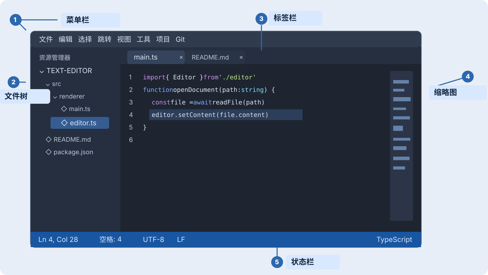
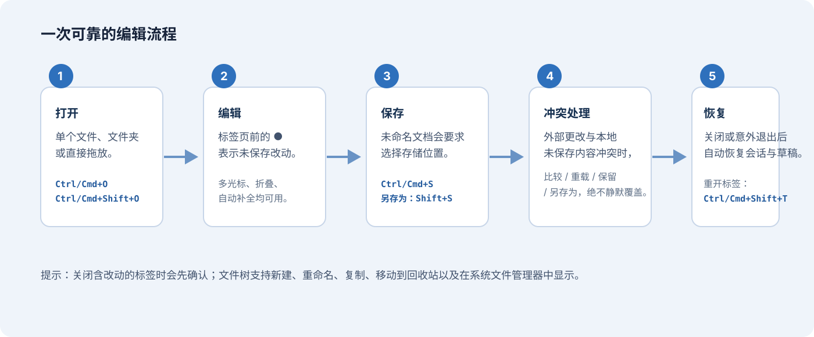
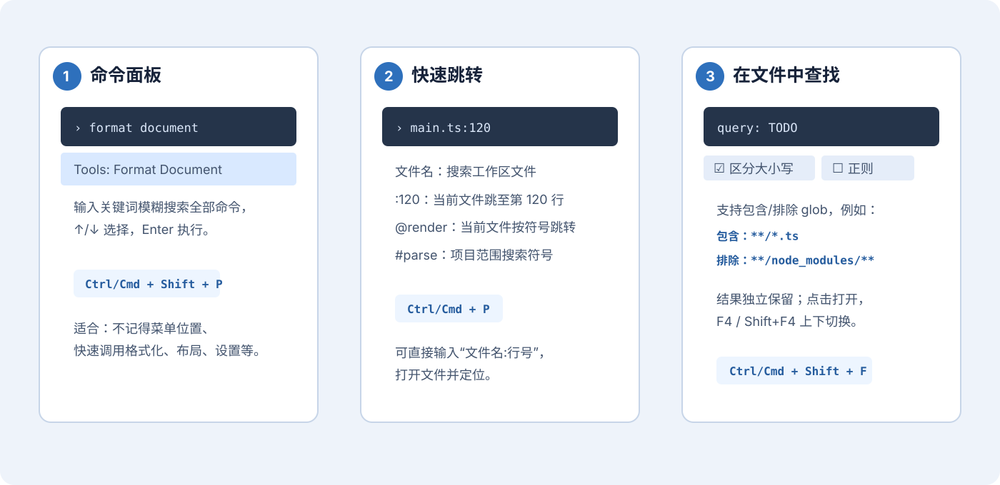
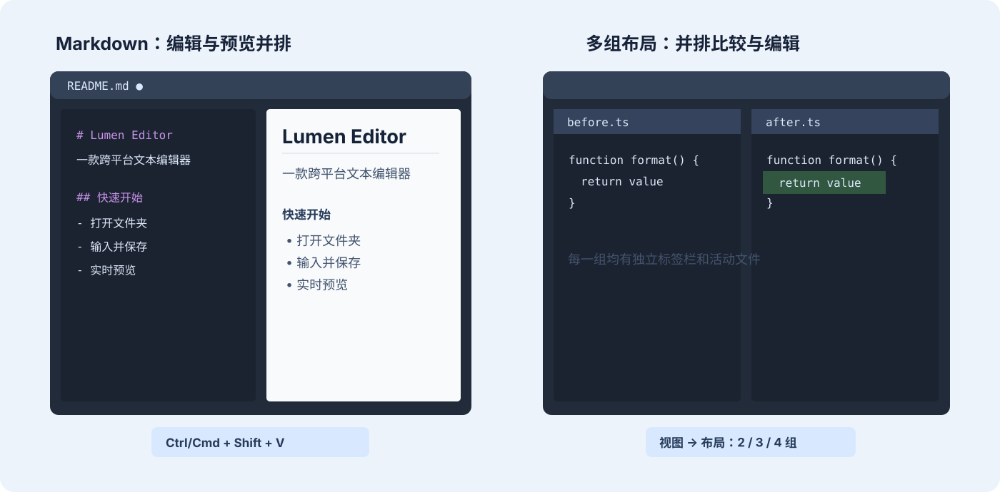
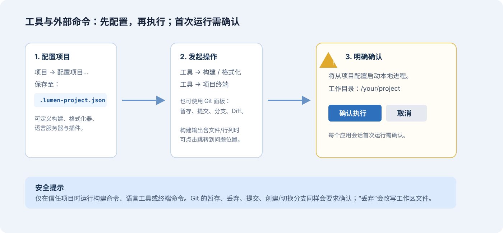

# Lumen Editor 编辑器使用指南

> 面向日常编辑、写作和编程的完整中文说明。
>
> 本文以当前版本的功能和菜单为准；快捷键中的 `Ctrl/Cmd` 表示 Windows/Linux 使用 `Ctrl`，macOS 使用 `Command (⌘)`。

Lumen Editor 是一款跨平台桌面文本编辑器，可用于文本、代码、Markdown、JSON 和 HTML 文件。它将文件管理、多标签编辑、项目搜索、预览、Git 与构建工具放在同一窗口中，同时会自动保存会话草稿，降低意外退出造成内容丢失的风险。



## 目录

1. [开始前与五分钟上手](#开始前与五分钟上手)
2. [认识界面](#认识界面)
3. [打开、编辑和保存文件](#打开编辑和保存文件)
4. [高效输入与编辑](#高效输入与编辑)
5. [查找、替换与快速跳转](#查找替换与快速跳转)
6. [语言模式、Markdown、HTML 与 JSON](#语言模式markdownhtml-与-json)
7. [标签、分栏与布局](#标签分栏与布局)
8. [外观、设置与自动保存](#外观设置与自动保存)
9. [项目工具：构建、终端、格式化与问题列表](#项目工具构建终端格式化与问题列表)
10. [Git 更改管理](#git-更改管理)
11. [项目配置、插件与语言服务](#项目配置插件与语言服务)
12. [会话恢复、外部更改与安全提示](#会话恢复外部更改与安全提示)
13. [常用快捷键速查](#常用快捷键速查)
14. [常见问题](#常见问题)

---

## 开始前与五分钟上手

### 你可以用它做什么

| 场景 | 推荐入口 | 说明 |
| --- | --- | --- |
| 修改一两个文件 | `文件 → 打开文件…` | 直接以标签页打开文件。 |
| 浏览或编辑一个项目 | `文件 → 打开文件夹…` | 加载文件树、项目搜索、符号索引、构建和 Git 功能。 |
| 写 Markdown 文档 | 保存为 `.md`，按 `Ctrl/Cmd+Shift+V` | 编辑与渲染预览可并排显示。 |
| 批量找代码或文字 | `Ctrl/Cmd+Shift+F` | 可限定目录、文件类型，并支持正则和替换。 |
| 对比多个文件 | `视图 → 布局：2 列/3 列/4 宫格` | 每一组拥有独立标签页和活动文件。 |
| 运行项目命令 | `工具 → 构建` 或 `工具 → 项目终端` | 仅对已打开的项目可用，首次执行会显示确认。 |

### 推荐的首次操作

1. 打开编辑器后，按 `Ctrl/Cmd+Shift+O`，选择你的项目文件夹。
2. 按 `Ctrl/Cmd+B` 展开侧边栏，在文件树中单击一个文件。
3. 修改内容；标签标题前出现 `●` 时，表示该文件尚未保存。
4. 按 `Ctrl/Cmd+S` 保存。新建、未命名文件会弹出系统保存对话框。
5. 需要找功能时，按 `Ctrl/Cmd+Shift+P` 并输入关键词，例如“格式化”“主题”“预览”。



> 小提示：也可以从操作系统文件管理器将本地文件或文件夹拖入编辑器窗口。第一个拖入的文件夹会成为主项目；后续拖入的文件夹会加入为额外项目根目录。

---

## 认识界面

上图中的数字对应以下区域。不同平台的窗口标题栏外观可能略有不同，但编辑器工作区保持一致。

| 编号 | 区域 | 用途 |
| --- | --- | --- |
| 1 | 菜单栏 | 按类别访问文件、编辑、选择、跳转、视图、工具、项目、Git 和设置命令。 |
| 2 | 侧边栏 / 文件树 | 显示打开项目的文件和目录；文件夹按需展开，不会一次性加载整个磁盘。 |
| 3 | 标签栏 | 每个打开的文件对应一个标签。`●` 代表未保存，`×` 用于关闭。 |
| 4 | 编辑区与缩略图 | 输入、选择和浏览内容的主区域。右侧缩略图可快速观察长文件结构。 |
| 5 | 状态栏 | 显示行列位置、选区信息、换行符、编码和当前语言。语言字段可点击切换。 |

### 使用菜单还是快捷键？

两种方式完全等效。初次使用时建议先通过菜单认识功能；熟悉后用快捷键更快。若只记得功能名称而忘了它在哪个菜单，直接打开**命令面板**（`Ctrl/Cmd+Shift+P`）搜索即可。

### 状态栏信息如何理解

- **行/列**：当前光标位置；可用于与构建报错、同事沟通定位。
- **选中信息**：选中文本时显示范围或字符数。
- **UTF-8**：当前文件的编码。编辑器保存时会沿用已识别的编码。
- **LF / CRLF / CR**：换行符格式。跨平台项目常需要保持原有格式。
- **语言**：语法高亮所使用的语言模式。单击它可手动指定语言。

---

## 打开、编辑和保存文件

### 打开方式

| 操作 | 快捷键 | 适用情况 |
| --- | --- | --- |
| 新建文件 | `Ctrl/Cmd+N` | 创建一个未命名的空白标签。 |
| 打开文件 | `Ctrl/Cmd+O` | 仅编辑一个或少量文件。 |
| 打开文件夹 | `Ctrl/Cmd+Shift+O` | 编辑代码库、文档集合或完整项目。 |
| 打开最近文件 | `文件 → 打开最近文件…` | 重新访问此前在编辑器中打开过的文件。 |
| 打开最近项目 | `项目 → 打开最近项目…` | 恢复曾打开过的工作目录。 |
| 拖放 | 将本地文件/文件夹拖进窗口 | 快速打开，不支持网页链接或纯文本拖放。 |

打开文件夹后，按 `Ctrl/Cmd+B` 显示或隐藏文件树。单击目录可展开或收起；单击文件会在标签栏中打开它。已经打开的文件再次单击时，只会切换到现有标签，不会重复打开。

### 文件树中的常用操作

右键单击文件或目录，可按对象使用以下操作：

- 新建文件或目录、重命名；
- 复制文件，在相同目录创建一个**不会覆盖原文件**的副本并自动打开；
- 移动到其他目录，或在系统文件管理器中显示；
- 移入系统回收站；执行前会要求确认；
- 复制完整路径或项目相对路径。

文件树会定期刷新外部改动。刷新不会丢失已展开的目录状态。

### 保存、另存为与自动保存

- `Ctrl/Cmd+S`：保存当前文件。未命名文件会要求选择路径。
- `Ctrl/Cmd+Shift+S`：无论文件是否已命名，均以“另存为”方式保存。
- `Ctrl/Cmd+Alt+S`：保存全部已打开且有改动的文件。
- `文件 → 循环切换自动保存模式`：在关闭、延时保存、失去焦点时保存之间切换。

关闭带有 `●` 的标签时，编辑器会要求确认，避免误关。即使尚未手动保存，编辑器也会把草稿写入会话记录，以便之后恢复；不过这不是替代正常保存的方式，重要内容仍应及时 `Ctrl/Cmd+S` 写回原文件。

### 标签页管理

- 单击标签切换文件；拖动标签可在同一编辑组中调整顺序。
- 按住 `Ctrl/Cmd` 单击多个标签可多选。选中多个标签后，可通过 `视图 → 将选中标签拆分为组` 并排查看。
- `Ctrl/Cmd+1` 至 `Ctrl/Cmd+9`：切换至第 1 至第 9 个标签。
- `Ctrl/Cmd+Alt+← / →`：切换上一个 / 下一个标签。
- `Ctrl/Cmd+W`：关闭当前标签。
- `Ctrl/Cmd+Shift+T`：按关闭顺序重开最近关闭的标签。

---

## 高效输入与编辑

### 基础编辑能力

编辑区提供撤销/重做、自动补全、括号匹配与自动闭合、自动缩进、代码折叠、当前行高亮和选中词高亮。折叠图标显示在可折叠代码块旁的边栏中。

| 操作 | 快捷键 | 说明 |
| --- | --- | --- |
| 撤销 / 重做 | `Ctrl/Cmd+Z` / `Ctrl/Cmd+Y` | 回退或恢复编辑操作。 |
| 切换行/块注释 | `Ctrl/Cmd+/` / `Ctrl/Cmd+Shift+/` | 取决于当前语言是否支持对应注释形式。 |
| 上移 / 下移行 | `Alt+↑ / ↓` | 不必剪切粘贴即可调整代码或段落顺序。 |
| 向上 / 下复制行 | `Shift+Alt+↑ / ↓` | 快速复制当前行或选区。 |
| 复制行/选区 | `Ctrl/Cmd+Shift+D` | 在当前位置复制。 |
| 删除行 | `Ctrl/Cmd+Shift+K` | 删除光标所在行或所选行。 |
| 删除前一个 / 后一个单词 | Win/Linux：`Ctrl+Backspace / Delete`；macOS：`Alt+Backspace / Delete` | 按词组边界快速删除。 |
| 删除至行首 / 行尾 | `Ctrl/Cmd+Shift+Backspace` / `Ctrl/Cmd+Shift+Delete` | 删除光标至当前行边界的内容。 |
| 在上方 / 下方新建空行 | `Ctrl/Cmd+Shift+Enter` / `Ctrl/Cmd+Enter` | 在当前行前后创建自动缩进空行，不拆分当前行。 |
| 在下方新建空行 | `Ctrl/Cmd+Enter` | 保留当前行内容，在其下创建自动缩进的空行。 |
| 转置相邻字符 | `Ctrl+T` | 交换光标两侧的字符，快速修正相邻字符顺序。 |
| 大小写转换 | 命令面板搜索 `Upper Case` / `Lower Case` / `Title Case` | 转换选区；没有选区时转换全文。 |
| 合并行 | 命令面板搜索 `Join Lines` | 合并选中行块；没有选区时合并当前行与下一行。 |
| 排序行 | 命令面板搜索“Sort Lines” | 对选区排序；没有选区时处理整个文件。 |
| 缩进 / 减少缩进 | `Ctrl/Cmd+] / [` | 对选区或当前行调整缩进。 |
| 自动重新缩进选区 | `Ctrl/Cmd+Alt+\` | 根据当前语言的语法规则重新计算所选行缩进。 |
| 选中整行 | Windows/Linux：`Alt+L`；macOS：`Ctrl+L` | 选择光标所在的完整行；多行选区会扩展为完整行。 |
| 选中至匹配括号 | `选择 → 选中至匹配括号` | 从当前选区活动端扩展到配对的 `()`、`[]` 或 `{}`。 |
| 选中外层语法结构 | `Ctrl/Cmd+I` | 选择光标或选区所在的下一层外部语法节点。 |
| 按行拆分选区 | 命令面板：`Split Selection into Lines` | 将选中行的每一行转换为一个行首光标。 |
| 扩展 / 缩小选区 | `Shift+Alt+→ / ←` | 逐级选择更大的结构或回退到上一级。 |
| 折叠 / 展开当前块 | Windows/Linux：`Ctrl+Shift+[ / ]`；macOS：`Cmd+Alt+[ / ]` | 收起或恢复光标所在代码块。 |
| 全部折叠 / 展开 | `Ctrl+Alt+[ / ]` | 一次处理当前文件全部可折叠代码块。 |

### 代码折叠

可折叠的函数、类、条件/循环块或 Markdown 区段会在左侧边栏显示折叠图标；单击即可切换。现在也可通过 `视图 → 折叠当前`、`展开当前`、`折叠全部`、`展开全部`，或在命令面板搜索 `Fold` / `Unfold` 执行。

- **折叠当前 / 展开当前**：适合临时隐藏当前函数内部细节，再专注周边调用关系。
- **折叠全部 / 展开全部**：适合快速浏览大型代码文件的顶层结构，或恢复完整内容。
- 如果当前语言/位置没有可折叠结构，编辑器会保留当前显示并在状态栏提示。

折叠状态会随标签和编辑组保留，在同一会话中切换文件或分栏不会丢失。

### 逐级扩展与缩小选区

`选择 → 扩展选区` 与 `选择 → 缩小选区` 对应主流编辑器中的 **Expand/Shrink Selection**。它特别适合在不使用鼠标的情况下选中表达式、参数、代码块或整段文本。

1. 将光标放在一个单词、字符串、参数或表达式中。
2. 按 `Shift+Alt+→` 逐次扩展选区。对于已识别语言，编辑器会优先沿语法结构向外扩展；例如从标识符到表达式、调用参数或外围代码块。
3. 在纯文本、无法解析的代码或已到达最大语法结构时，扩展顺序会回退为**单词 → 当前行 → 全文**。
4. 多按一次 `Shift+Alt+←` 即可按本次扩展路径逐级缩小。移动光标、手动选择文本或修改内容后，旧的扩展路径会自动失效，以免缩回到不相关的位置。

这一功能适合先精确定位再进行包裹、删除、复制、大小写转换或多光标编辑。快捷键与默认文本导航不冲突；也可在命令面板搜索“Expand Selection”或“Shrink Selection”。

### 快速选择行与括号范围

- **选中整行**：`选择 → 选中整行` 对应 Windows/Linux 的 `Alt+L`、macOS 的 `Ctrl+L`。它会覆盖光标所在的完整物理行（包括行尾换行符，若存在），很适合复制、移动或注释整行。
- **选中至匹配括号**：将光标或选区活动端放在、或紧邻 `()`、`[]`、`{}` 等括号后，执行 `选择 → 选中至匹配括号`。选区会延伸到另一端，适合复制调用参数、条件表达式或代码块；没有匹配时不会修改选区。

两项操作均可在命令面板中搜索 `Select Line` 与 `Select to Matching Bracket`。

### 选中外层语法结构

`选择 → 选中外层语法结构`（`Ctrl/Cmd+I`）会根据当前文件语言的语法树，选择光标/选区所在的下一层外部结构。例如，可从标识符扩展到表达式、函数参数、调用、条件语句或整个代码块。

它适合在代码中精确扩大选择后执行复制、删除、包裹或重构。若当前语言是纯文本、语法尚未解析，或已经位于最大结构，编辑器会保留原选区并提示；需要继续逐级扩大时，也可使用“扩展选区”。

### 按行拆分选区

`选择 → 按行拆分选区` 会将一个或多个非空选区覆盖的每行，转为该行开头的独立光标。它特别适合先选择多行，再一次性在每行前添加内容、插入前缀或进行列式修改。

- 多个选区会同时处理；重叠的行只生成一个光标；
- 选区如果刚好结束在下一行开头，不会把那一行误计入；
- 会保留原主选区对应的主光标；没有任何选区时不会改动文本或光标，并会显示提示。

### 多光标与多处编辑

当同一个词、属性或变量要在多个位置同时改名时，多光标比逐个查找更稳妥。

| 方式 | 操作 |
| --- | --- |
| 选择下一个相同内容 | 选中文本后按 `Ctrl/Cmd+D`，可重复按以增加下一个匹配处。 |
| 选择所有相同内容 | `Alt+F3`。 |
| 在上方 / 下方添加光标 | `Ctrl/Cmd+Alt+↑ / ↓`。 |
| 鼠标增加光标 | 按住 `Alt` 单击。 |
| 矩形（列）选择 | 按住 `Alt` 拖动。 |
| 退出多光标 | `Esc`。 |

使用多光标批量修改前，先确认选中的匹配是否都是目标内容。若涉及跨文件重命名，优先使用已配置语言服务的 **重命名符号**（`F2`），它比纯文本替换更能理解代码结构。

### 转置相邻字符

当输入时把两个相邻字符的顺序写反，例如把 `teh` 写成 `the`，将光标放在这两个字符之后并按 `Ctrl+T`，即可交换它们。该命令也可通过 `编辑 → 转置相邻字符` 或命令面板的 `Transpose Characters` 调用。

- 转置遵循 Unicode 字符边界，不会把组合字符拆开；
- 若光标位于行首或当前位置没有可交换的相邻字符，文本保持不变并显示提示；
- 操作与其他输入一样可用 `Ctrl/Cmd+Z` 撤销。

### 在下方新建空行

`编辑 → 在下方新建空行`（`Ctrl/Cmd+Enter`）会在当前行下方插入一个空行，并把光标放在新行内。与普通 Enter 不同，它不会先把当前行从光标处分开，因此可以在一行代码或文字尚未写完时，直接开始编辑下一行。

新行会沿用当前语言的自动缩进规则；在多个光标下，每个光标所在行都会创建对应的新行。此操作与普通输入一样可撤销。

### 在上方新建空行

`编辑 → 在上方新建空行`（`Ctrl/Cmd+Shift+Enter`）是“在下方新建空行”的对称操作：它会在当前行之前创建一个空行，并把光标放在该新行中。

- 新行保留当前行已有的前导缩进，便于在代码块或列表中补一行；
- 不会从光标处拆开或移动当前行内容；
- 多个光标位于同一行时只创建一行，位于不同的行时分别创建；
- 可与 `Ctrl/Cmd+Enter` 组合，在当前行上下快速补充结构，并可一次撤销。

### 删除至行首或行尾

`编辑 → 删除至行首` 与 `删除至行尾` 分别对应 `Ctrl/Cmd+Shift+Backspace`、`Ctrl/Cmd+Shift+Delete`。它们适合快速清除当前行剩余内容，而无需拖选：

- 有选区时，直接删除选区；
- 单光标时，删除光标到当前行首或行尾的文本；
- 光标已在行首/行尾时，分别删除前一个/后一个换行，使两行连接；
- 多光标下会在每个光标位置执行同样的操作，且可一次撤销。

### 删除前一个或后一个单词

`编辑 → 删除前一个单词`、`删除后一个单词` 能按编辑器识别的词组边界快速删除，适合重写变量名、命令参数或普通文字：

- Windows/Linux 默认使用 `Ctrl+Backspace`、`Ctrl+Delete`；macOS 使用 `Alt+Backspace`、`Alt+Delete`；
- 有选区时会直接删除选区；
- 在代码中，字母数字组、下划线及相邻标点会按词组边界处理；连续按键可逐段清理；
- 多光标下每个位置独立执行，全部删除可一次撤销。

### 多选区大小写转换

通过命令面板执行 `编辑：转为大写`、`转为小写` 或 `转为标题格式` 时，编辑器会按以下规则工作：

- 有一个或多个非空选区时：每个选区单独转换，适合配合多光标批量规范变量、标题或标签文本；
- 没有选区时：转换当前文档全文，延续原有快速清理文本的用法；
- 转换后会保留每个选区的对应范围，可继续执行下一步操作；所有转换均可撤销。

### 合并行

执行 `编辑 → 合并行`（或命令面板搜索 `Join Lines`）可移除行之间的换行与两侧多余空白，并以一个空格连接文本。

- 有选区时：合并选区覆盖的全部行；多个独立选区会分别处理，重叠范围只会合并一次；
- 没有选区时：合并光标所在行和下一行，方便把意外断行快速接回；
- 位于最后一行或范围内没有可合并换行时，文本不会改变，并会在状态栏提示；
- 每个合并后的行块会保留一个光标，且整个操作可一次撤销。

### 自动重新缩进选区

`编辑 → 自动重新缩进选区`（`Ctrl/Cmd+Alt+\`）会调用当前语言提供的缩进规则，重新整理选中行的前导空白。这与 `Ctrl/Cmd+] / [` 的手工增减一级不同，特别适合：

- 粘贴后缩进层级错乱的代码块；
- 修改 `{}`、Python 块、列表或条件分支后需要恢复结构；
- 只想修正局部行，而不运行可能改写全文的外部格式化器。

该操作使用当前文档语言的本地规则，不启动 LSP、终端或外部命令；若语言无法推断目标缩进或选区没有可处理的行，文本保持不变并显示提示。

### 书签、宏和片段

- **书签**：`Ctrl/Cmd+F2` 在当前行添加/取消书签；`F2`、`Shift+F2` 在书签间前后跳转。
- **宏**：在“工具”菜单中开始/停止录制，随后可重放、保存到项目或选择已保存的宏执行。适合重复执行一组编辑命令。
- **片段**：`工具 → 插入片段…` 可插入内置片段、项目片段或插件片段。项目中的 `.sublime-snippet` 也可从工具菜单导入。

---

## 查找、替换与快速跳转



### 当前文件查找与替换

| 功能 | 快捷键 | 说明 |
| --- | --- | --- |
| 查找 | `Ctrl/Cmd+F` | 在当前文件打开查找栏。 |
| 替换 | `Ctrl/Cmd+H` | 打开查找与替换栏。 |
| 下一个匹配 | `F3` 或查找栏中的 `Enter` | 前往下一个结果。 |
| 正则 / 大小写 / 全词 | 查找栏中的选项 | 可组合使用，缩小误匹配范围。 |

注意：`Ctrl/Cmd+G` 在 Lumen 中是**跳转到行**，不是“查找下一个”；查找下一个请使用 `F3`。

### 在文件中查找与批量替换

1. 先打开项目文件夹。
2. 按 `Ctrl/Cmd+Shift+F` 搜索项目中的内容，或按 `Ctrl/Cmd+Shift+H` 进入项目替换。
3. 在搜索面板中选择是否使用正则、是否区分大小写、是否匹配整个单词。
4. 需要缩小范围时填写 glob：例如“包含”写 `**/*.ts`，排除依赖目录可写 `**/node_modules/**`。
5. 点击结果可打开对应文件并定位到匹配处；使用 `F4` / `Shift+F4` 在结果间前后跳转。

项目替换会在写入前再次确认，并尽量保留各文件已有的编码与换行符。替换后若发现范围有误，可使用 `编辑 → 撤销上次在文件中替换` 回退最近一次项目替换。

### 命令面板

按 `Ctrl/Cmd+Shift+P` 打开命令面板，输入名称中的任意几个字符即可模糊筛选。使用 `↑/↓` 选择，`Enter` 执行，`Esc` 关闭。

适合搜索的命令示例：

- `Format Document`：格式化当前文档；
- `Toggle Word Wrap`：切换自动换行；
- `Layout Columns 2`：切换为两列布局；
- `Open Settings`：打开图形设置面板；
- `Set Syntax`：手动选择语法语言。

### Goto Anything 与符号导航

按 `Ctrl/Cmd+P` 打开 **Goto Anything**。它会在同一个输入框中根据前缀切换模式：

| 输入形式 | 效果 | 例子 |
| --- | --- | --- |
| 普通文本 | 模糊搜索工作区文件 | `maints` |
| `:行号[:列号]` | 在当前文件跳至指定行/列 | `:120:8` |
| `@名称` | 搜索当前文件的函数、类、方法或 Markdown 标题 | `@render` |
| `#名称` | 搜索项目范围的符号 | `#parseConfig` |
| `文件名:行号[:列号]` | 打开匹配文件并跳到行/列 | `main.ts:120:8` |

此外：

- `Ctrl/Cmd+R`：直接跳转当前文件符号。
- `Ctrl/Cmd+Shift+R`：搜索项目符号。
- `Ctrl/Cmd+G`：直接输入行号跳转，也支持 `行:列`、相对行（如 `+10`）和百分比（如 `50%`）。
- `Ctrl/Cmd+Shift+\`：在开/闭括号及其紧邻位置之间跳转；对 `()`、`[]`、`{}` 等代码结构尤其适用。没有匹配项时光标不会移动。
- `Alt+← / →`：在跳转历史中后退/前进。

没有打开项目时，`Ctrl/Cmd+P` 仍可用于当前文件的 `:行号[:列号]` 和 `@符号`；文件搜索和项目符号则需要先打开文件夹。

---

## 语言模式、Markdown、HTML 与 JSON

### 语法高亮与语言选择

编辑器会根据文件扩展名自动识别 100 多种语言。要覆盖自动识别，可单击状态栏右侧的语言名称，或打开命令面板执行 `视图：设置语法…`。手动选择后，当前文档会锁定该语言，不会因切换标签或再次保存而被扩展名自动覆盖。

未保存文件默认是“纯文本”。若你正在写没有扩展名的 Markdown、JSON 或代码，可以先手动设置语言，再使用相关功能。

### Markdown 实时预览



1. 打开或新建一个 `.md`、`.markdown` 等 Markdown 文件；也可手动将语言设为 Markdown。
2. 按 `Ctrl/Cmd+Shift+V`，或单击编辑区右上角的 Markdown 图标。
3. 预览窗格将在编辑器旁显示，并随输入实时更新。再次执行同一命令即可关闭。

Markdown 转换后的 HTML 会经过净化处理，以阻止脚本、危险事件属性和 `javascript:` 链接在预览中执行。预览中的普通链接会交给系统浏览器打开。

### 在浏览器中查看 HTML

打开 `.html` 或 `.htm` 文件时，编辑区右上角会显示浏览器图标。单击它，或执行 `视图 → 在浏览器中打开`。

- 已保存且没有未保存改动的文件，会直接以真实文件路径在默认浏览器打开。
- 未命名的 HTML，或已经编辑但未保存的 HTML，会以临时快照打开。它**不会弹出保存窗口，也不会修改源文件**。
- 对已保存但有改动的 HTML，临时快照会保持相对 CSS、脚本与图片资源以原文件目录为基准。

### JSON 工具

对 `.json`、`.jsonc`、`.geojson`、`.har` 文件（或手动选择 JSON 语言）：

- `工具 → 格式化 JSON`：按层级缩进整理；
- `工具 → 压缩 JSON`：移除不必要的空白；
- `工具 → 切换 JSON 视图`：以结构化视图浏览内容。

当 JSON 无法解析时，编辑器会提示错误并且不修改原始文本。建议先修正语法，再执行格式化或压缩。

---

## 标签、分栏与布局

### 单文件双编辑器

`视图 → 切换分屏编辑器`（`Ctrl/Cmd+Alt+2`）会为当前文件打开第二个同步编辑视图，适合一边修改文件前半部分、一边参考后半部分。每个标签会分别保存选区、光标、折叠状态和撤销历史。

### 多个编辑组

在“视图”菜单中选择以下布局：

- **单组**：一个编辑组，适合专注写作。
- **2 列 / 3 列**：横向并排对比文件、实现和测试。
- **4 宫格**：同时查看多个相关文件。

每个编辑组都有独立的标签栏和活动文件。可以使用：

- `视图 → 移动文件到下一组`：将当前文件移到后一个组；
- `视图 → 克隆文件到下一组`：在两个组内同时打开同一个文件；
- `Ctrl/Cmd+Alt+[ / ]`：切换当前聚焦的编辑组；
- 多选标签后执行“将选中标签拆分为组”：快速对照多个文件。

### 适合的用法

| 任务 | 推荐布局 |
| --- | --- |
| 修改函数并参考接口定义 | 2 列：定义在左，实现文件在右。 |
| 修改代码并观察测试 | 2 列：源文件 + 测试文件。 |
| 处理冲突或比较改动 | 2 列：磁盘版本 / 当前版本，或两个相关文件。 |
| 审阅多个模块 | 3 列或 4 宫格，按模块分别放置。 |

编辑器会保存窗口的布局、各组标签顺序和活动文件，下次启动时尽量恢复。

---

## 外观、设置与自动保存

按 `Ctrl/Cmd+,`，或选择 `偏好设置 → 打开设置…`，可以打开图形化设置面板。设置更改会立即生效并自动保存。

| 设置 | 可调整内容 |
| --- | --- |
| 界面语言 | 简体中文或 English。 |
| 配色方案 | Dark、Light、Solarized Dark、Dracula。 |
| 字号 | 8–40 px；也可 `Ctrl/Cmd+=` 放大、`Ctrl/Cmd+-` 缩小、`Ctrl/Cmd+0` 重置。 |
| 缩进 | Tab 宽度，以及输入 Tab 时使用空格或制表符。 |
| 自动保存 | 关闭、延时保存、失去焦点时保存；可设置延时时间。 |
| 可视辅助 | 缩略图、缩进参考线、行尾空白高亮、自动换行、当前文件大纲、拼写检查。 |
| 专注模式 | 隐去干扰，专注当前内容；按 `Esc` 退出。 |

### 常用视图切换

| 功能 | 快捷键 / 菜单 |
| --- | --- |
| 显示/隐藏侧边栏 | `Ctrl/Cmd+B` |
| 自动换行 | `Alt+Z` |
| 切换深浅主题 | `Ctrl/Cmd+K` |
| 显示/隐藏缩略图 | `视图 → 切换缩略图` |
| 显示/隐藏大纲 | `视图 → 切换大纲` |
| 专注模式 | `Shift+F11` |
| 全屏 | `视图 → 切换全屏` |

设置文件由应用维护在系统用户数据目录中；大多数用户无需手动编辑。如果要备份个人偏好，可备份其中的 `settings.json`；会话信息也存放在同一位置的 `session.json`。

---

## 项目工具：构建、终端、格式化与问题列表



这些能力以**已打开的主项目文件夹**为范围。第一次使用前，先确认自己信任该项目及其配置中的外部命令。

### 构建

1. 打开项目后，选择 `项目 → 配置项目…`。
2. 在配置中填写构建命令，或用 `工具 → 选择构建系统…` 选择一个命名构建系统。
3. 按 `Ctrl/Cmd+Shift+B`，或点击 `工具 → 构建`。
4. 构建输出会出现在底部面板；如果输出被配置为可识别的“文件:行:列”格式，单击问题项可跳转到源代码位置。

构建命令会在本次应用会话首次运行时请求确认。此确认提示会明确说明工作目录与将要启动的本地进程。

### 项目终端

通过 `工具 → 切换终端`（`Ctrl/Cmd+Alt+T`）打开项目终端。它会以主项目根目录作为工作目录。首次启动前会显示明确的确认提示。

终端适合运行常规命令、脚本和测试。当前终端采用基础文本交互（`TERM=dumb`）；全屏终端程序和大量依赖光标控制的 TUI，例如 `vim` 或 `htop`，不在支持范围内。关闭终端、关闭窗口或退出应用时，编辑器会停止相应 shell 与其 POSIX 子进程组。

### 文档格式化与诊断

`工具 → 格式化文档` 会根据项目配置调用：

- 标准输入/输出格式化器，例如将当前文本传给一个命令并接收格式化结果；或
- 已配置的语言服务器（LSP）提供的格式化能力。

格式化器和语言服务器均是外部程序，因此首次启动会要求确认。语言服务还可提供补全、悬停提示、跳转定义（`F12`）、查找引用（`Shift+F12`）和重命名符号（`F2`）。未配置 LSP 时，编辑器仍可用本地项目词条和符号索引提供基础补全/导航。

### 文档统计

选择 `工具 → 文档统计`，或在命令面板中搜索 `Document Statistics`，即可查看当前缓冲区的：

- 行数；
- 字符数，以及排除空白后的字符数；
- 词 / 标记数。

如果有选中内容，弹窗还会单独列出选区的同类统计，适合控制摘要、提交说明或文章段落的长度。统计只读取当前编辑器中的内存文本，不需要保存文件、不要求打开项目，也不会改动内容。字符按用户可见的 Unicode 字符计算；词 / 标记统计能处理中文连续文本、组合字符和 emoji，不依赖英文空格分词。

### Problems（问题）和构建输出

选择 `工具 → 切换构建输出` 可以显示或隐藏输出面板。只要构建系统正确设置了报错行匹配规则，列表中的问题项会包含文件、行、列和消息，点击即可定位。对于不能自动解析的工具输出，仍可在终端或输出面板中复制文本并用“跳转到行”定位。

---

## Git 更改管理

对 Git 仓库项目，选择 `视图 → 切换 Git 更改` 打开 Git 面板；`Git → 刷新更改` 用于重新读取状态。

### 查看更改

- 面板标题显示当前分支。
- 单击文件会打开它；双击文件显示文本 Diff。
- 选中一个文件后，可查看分块（hunk）、文件历史和 Blame。
- 按住 `Ctrl/Cmd` 单击可选择多个文件，便于批量暂存、取消暂存或丢弃。

### 写操作与确认

Git 面板提供暂存、取消暂存、丢弃、按 hunk 暂存/丢弃、提交、新建分支和切换分支。它们均会在真正执行前要求确认。尤其是**丢弃**会改写工作区文件，通常难以从编辑器内恢复；请先查看 Diff 并确认目标文件无误。

若项目存在合并冲突，可使用 `Git → 打开合并冲突` 将冲突文件打开后自行处理。完成后保存文件，再使用 Git 面板暂存和提交。

---

## 项目配置、插件与语言服务

### `.lumen-project.json` 是什么

打开项目后，选择 `项目 → 配置项目…`，编辑器会读取或创建项目根目录中的 `.lumen-project.json`。这份文件可随项目一起版本管理，用来共享排除规则、构建命令、快捷键、片段、语言工具和语言服务器配置。

下面是一个精简示例；按项目实际工具修改：

```jsonc
{
  "exclude": ["**/generated/**", "**/*.min.js"],
  "buildCommand": "npm test",
  "keyBindings": {
    "Mod+Shift+R": "build"
  },
  "languageTools": {
    "Python": {
      "command": "black -q -",
      "args": []
    }
  },
  "languageServers": {
    "TypeScript": {
      "command": "typescript-language-server",
      "args": ["--stdio"]
    }
  }
}
```

`languageTools` 与 `languageServers` 的命令必须已在本机可执行。编辑器不会自动下载它们，也不会在未确认前直接运行。

### 多根项目

选择 `项目 → 添加文件夹到项目…` 可把额外目录加入当前工作区。文件树、Goto Anything、项目搜索和项目符号会覆盖全部根目录；构建、Git 与项目配置始终以第一个主根目录为准，避免跨仓库误操作。

`项目 → 从项目移除文件夹…` 只会移除工作区范围，不会删除磁盘文件。已经打开的文件标签仍会保留，但该目录不再参与文件树、搜索、符号索引、构建、Git 或终端。

### 插件与市场

可在“工具”菜单中安装本地声明式插件、管理插件，或浏览 HTTPS 市场。声明式插件只能提供片段和“插入文本”命令；可选 Worker 也只能在受控环境中读取或修改当前文档，并会在首次启用时请求权限确认。

安装来自网络或其他人的插件前，请检查来源、名称、版本和权限。插件市场与清单 URL 只接受 HTTPS；若插件包含 Worker，编辑器还会验证其来源与完整性摘要。

### 导入 Sublime Text 配置

若从 Sublime Text 迁移，可使用以下入口：

- `项目 → 导入 Sublime 项目…`：导入文件夹、排除规则和构建系统；不会执行 Sublime 的 Python 插件。
- `偏好设置 → 导入 Sublime 设置…` / `导入 Sublime 键位映射…`。
- `工具 → 导入 Sublime 构建系统…`。
- `工具 → 导入 Sublime 片段…`。

导入会先展示或确认内容；导入配置本身不等于执行命令，实际运行构建/格式化命令时仍会再次确认。

---

## 会话恢复、外部更改与安全提示

### 会话恢复和热退出

编辑器会保存打开的文件、文件夹、窗口布局、组内标签顺序、活动文件和未保存草稿。下次启动时，它会尝试自动恢复这些状态。若已保存的文件在关闭期间被删除或移动，但上次有未保存草稿，编辑器会把草稿以“recovered”标签保留，而不是静默丢弃。

这项机制可防止意外崩溃带来的多数损失，但它不能代替版本控制或常规保存：

- 关键修改应及时保存；
- 重要项目应使用 Git 提交；
- 在大范围替换、格式化或执行外部命令前，先查看 Diff 或提交一个可回退的版本。

### 文件被外部程序修改时

如果文件在磁盘上被其他程序修改，而你在 Lumen 中又有未保存编辑，编辑器不会静默覆盖任何一方。顶部会提供四种选择：

| 选项 | 作用 |
| --- | --- |
| 比较 | 打开一个临时的磁盘版本标签，供你手动对照。 |
| 重新加载磁盘版本 | 放弃当前未保存内容，采用磁盘内容。 |
| 保留本地版本 | 继续保留编辑器里的内容，忽略这次外部变化。 |
| 另存为 | 将本地内容写入一个新位置，避免覆盖原文件。 |

需要保留双方改动时，推荐先使用“比较”，再将需要的部分手工合并。

### 安全边界

Lumen 使用隔离的渲染进程；编辑界面和插件不会直接获得 Node、文件系统或进程对象。文件访问通过受控接口完成，外部命令、项目终端、Git 写操作和可能改变磁盘内容的高风险操作会在需要时给出确认。

你仍应遵循基本原则：

- 仅对可信来源的项目确认执行构建、格式化、语言服务器或终端命令；
- 项目配置中的命令等同于本地命令，请先阅读其内容；
- 删除/丢弃/替换前核对对象和范围；
- 不要将密码、密钥或令牌放入截图、日志、公开的项目配置或插件清单。

---

## 常用快捷键速查

### 文件、视图与导航

| 操作 | 快捷键 |
| --- | --- |
| 命令面板 | `Ctrl/Cmd+Shift+P` |
| Goto Anything（文件 / `:行[:列]` / `@符号` / `#项目符号`） | `Ctrl/Cmd+P` |
| 跳转当前文件符号 / 项目符号 | `Ctrl/Cmd+R` / `Ctrl/Cmd+Shift+R` |
| 跳转到行 | `Ctrl/Cmd+G` |
| 跳转到匹配括号 | `Ctrl/Cmd+Shift+\` |
| 跳转定义 / 查找引用 / 重命名符号 | `F12` / `Shift+F12` / `F2` |
| 跳转历史后退 / 前进 | `Alt+← / →` |
| 新建 / 打开文件 / 打开文件夹 | `Ctrl/Cmd+N` / `Ctrl/Cmd+O` / `Ctrl/Cmd+Shift+O` |
| 保存 / 另存为 / 全部保存 | `Ctrl/Cmd+S` / `Ctrl/Cmd+Shift+S` / `Ctrl/Cmd+Alt+S` |
| 关闭 / 重开标签 | `Ctrl/Cmd+W` / `Ctrl/Cmd+Shift+T` |
| 上一个 / 下一个标签 | `Ctrl/Cmd+Alt+← / →` |
| 显示/隐藏侧边栏 | `Ctrl/Cmd+B` |
| Markdown 预览 | `Ctrl/Cmd+Shift+V` |
| 分屏编辑器 | `Ctrl/Cmd+Alt+2` |
| 切换编辑组 | `Ctrl/Cmd+Alt+[ / ]` |
| 项目构建 | `Ctrl/Cmd+Shift+B` |
| 项目终端 | `Ctrl/Cmd+Alt+T` |

### 编辑、查找与显示

| 操作 | 快捷键 |
| --- | --- |
| 查找 / 替换 | `Ctrl/Cmd+F` / `Ctrl/Cmd+H` |
| 在文件中查找 / 替换 | `Ctrl/Cmd+Shift+F` / `Ctrl/Cmd+Shift+H` |
| 下一条 / 上一条项目查找结果 | `F4` / `Shift+F4` |
| 切换行注释 / 块注释 | `Ctrl/Cmd+/` / `Ctrl/Cmd+Shift+/` |
| 增加下一个匹配 / 选择全部匹配 | `Ctrl/Cmd+D` / `Alt+F3` |
| 选中整行 | Win/Linux：`Alt+L`；macOS：`Ctrl+L` |
| 选中至匹配括号 | `选择 → 选中至匹配括号` |
| 选中外层语法结构 | `Ctrl/Cmd+I` |
| 按行拆分选区 | 命令面板：`Split Selection into Lines` |
| 扩展 / 缩小选区 | `Shift+Alt+→ / ←` |
| 折叠 / 展开当前块 | Win/Linux：`Ctrl+Shift+[ / ]`；macOS：`Cmd+Alt+[ / ]` |
| 全部折叠 / 展开 | `Ctrl+Alt+[ / ]` |
| 上/下增加光标 | `Ctrl/Cmd+Alt+↑ / ↓` |
| 移动行 | `Alt+↑ / ↓` |
| 复制行 | `Shift+Alt+↑ / ↓` |
| 复制行/选区 / 删除行 | `Ctrl/Cmd+Shift+D` / `Ctrl/Cmd+Shift+K` |
| 删除前一个 / 后一个单词 | Win/Linux：`Ctrl+Backspace / Delete`；macOS：`Alt+Backspace / Delete` |
| 删除至行首 / 行尾 | `Ctrl/Cmd+Shift+Backspace` / `Ctrl/Cmd+Shift+Delete` |
| 在上方 / 下方新建空行 | `Ctrl/Cmd+Shift+Enter` / `Ctrl/Cmd+Enter` |
| 在下方新建空行 | `Ctrl/Cmd+Enter` |
| 转置相邻字符 | `Ctrl+T` |
| 大小写转换 | 命令面板：`Upper / Lower / Title Case` |
| 合并行 | 命令面板：`Join Lines` |
| 自动重新缩进选区 | `Ctrl/Cmd+Alt+\` |
| 切换书签 / 前后书签 | `Ctrl/Cmd+F2` / `F2` / `Shift+F2` |
| 自动换行 | `Alt+Z` |
| 切换主题 | `Ctrl/Cmd+K` |
| 字号放大 / 缩小 / 重置 | `Ctrl/Cmd+=` / `Ctrl/Cmd+-` / `Ctrl/Cmd+0` |
| 专注模式 | `Shift+F11` |

---

## 常见问题

### 为什么 `Ctrl/Cmd+P` 找不到文件？

文件模糊搜索依赖已打开的项目文件夹。先用 `Ctrl/Cmd+Shift+O` 打开文件夹；若只是在单个未保存文件中工作，仍可使用 `:行号` 和 `@符号` 两种跳转。

### 为什么没有 Markdown 预览或浏览器图标？

Markdown 预览只对 Markdown 文件或手动设为 Markdown 的文档显示；浏览器图标只对 HTML 文件或手动设为 HTML 的文档显示。检查文件扩展名，或单击状态栏语言字段手动切换。

### 为什么运行构建、格式化器或终端时会提示确认？

这些操作会启动本地进程，可能读写项目文件或执行任意项目脚本。编辑器以“每个应用会话首次执行前确认”的方式，让你在信任项目后再运行。

### 如何处理太大的文件或二进制文件？

编辑器会避免将二进制文件或超过设置上限的文件载入文本编辑器。可在设置中调整“文件大小上限（MB）”；对于日志、媒体、数据库等大文件，建议使用专用工具查看。

### 文件树或 Git 状态看起来没有更新？

文件树会自动刷新；也可以重新打开项目。Git 面板中使用 `Git → 刷新更改` 主动刷新。若文件仍显示异常，确认它是否位于当前主项目或额外项目根目录内。

### 如何安装或从源码运行编辑器？

请查看 [安装与使用说明](./使用说明.md)。开发者的构建、打包和平台注意事项也在该文档及项目根目录的 [中文 README](../README.zh-CN.md) 中说明。

---

## 相关文档

- [安装与使用说明](./使用说明.md)：安装包、从源码启动与打包说明。
- [中文 README](../README.zh-CN.md)：功能概览、开发命令与项目结构。
- [English User Guide](./USER_GUIDE.md)：英文版完整使用说明。
